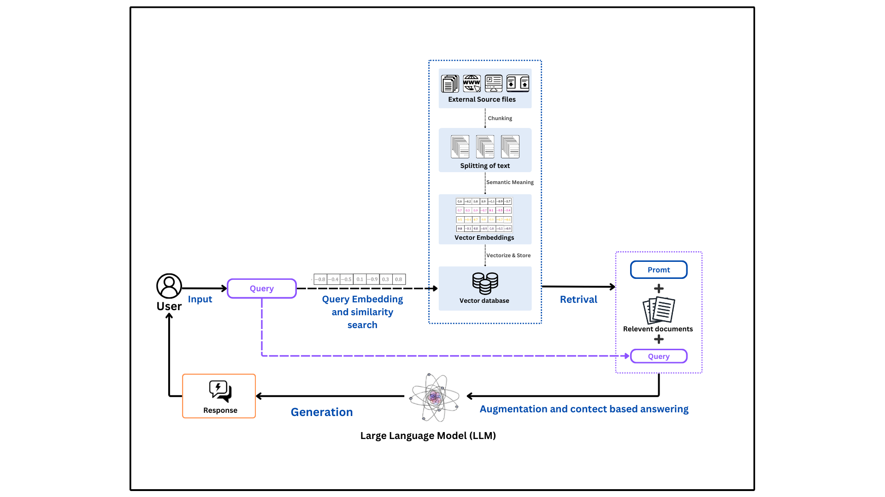

# RAG

## Unlock the Future of Exam Preparation with the RAG Chatbot!

Imagine having a personal study assistant that not only reads your notes but summarizes entire chapters, crafts exam-ready questions, and delivers precise answers to even the trickiest queries—all tailored to your syllabus.

The **Retrieval-Augmented Generation (RAG) Chatbot** is a revolutionary AI-powered companion designed for Mumbai University students. It transforms hours of tedious studying into a seamless, interactive experience. Whether you’re cramming for an exam or building long-term understanding, this chatbot ensures you’re always a step ahead with smarter, faster, and more personalized preparation.

Ready to change the way you learn? Dive in and discover the future of academic excellence. 🚀

## Features

- **Document Summarization**: Upload study materials, and the chatbot generates concise chapter-wise summaries.
- **Curated Questions**: Automatically generates 10 curated questions from each chapter to help with exam practice.
- **Contextual Question-Answering**: Delivers precise answers based on uploaded academic content, including syllabi, reference books, and past exam papers.
- **Personalized Learning**: Adapts responses to users' specific academic needs.
- **User-Friendly Interface**: Intuitive design for seamless interaction.

## How Does It Work

## Demo

Watch the demo video below to see how the RAG Chatbot works in action:

[![Watch the demo]](RAG/rag_demo.mp4)

